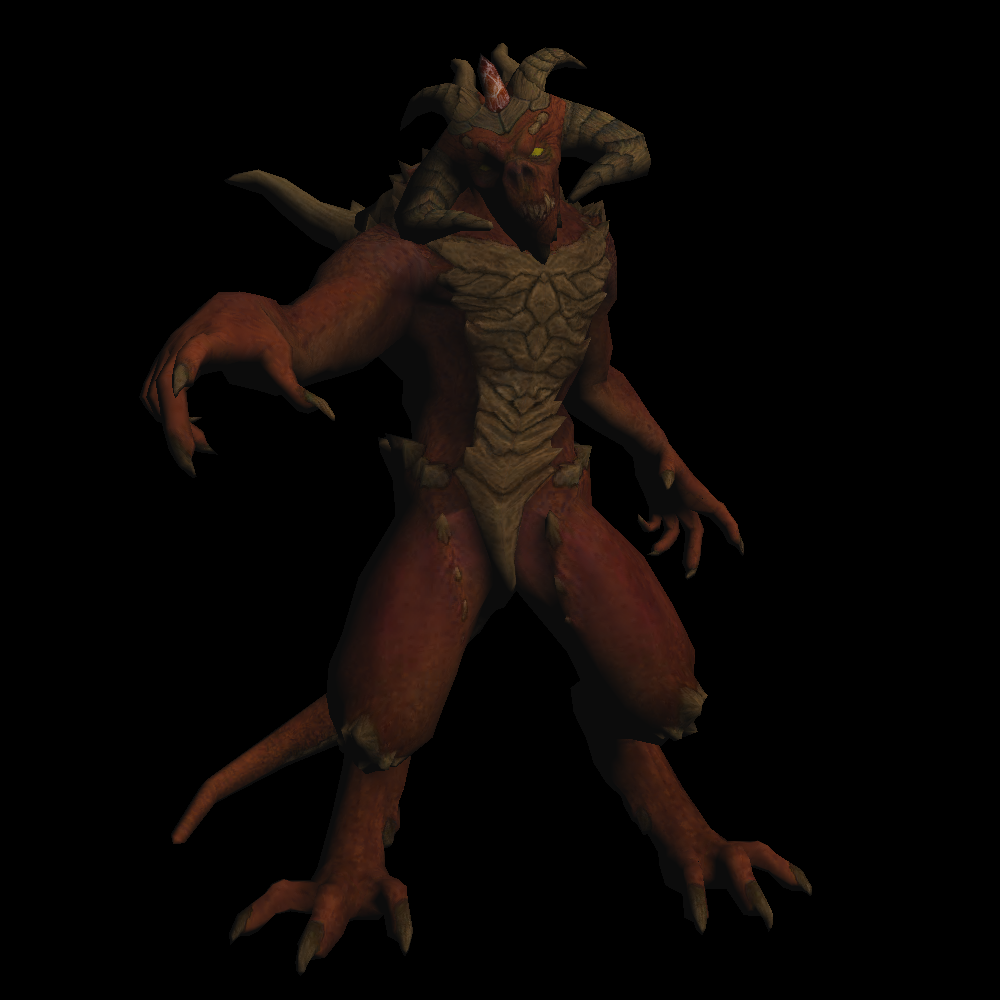

# lunarenderer

a tiny renderer with no graphic APIs

Features to be added in the future:

1. comprehensive model file loader for various format (fbx, glb)

2. normal map
3. structure development for multiparts models (like models from dota2)
4. optimized code structure 

Samples:

​	
